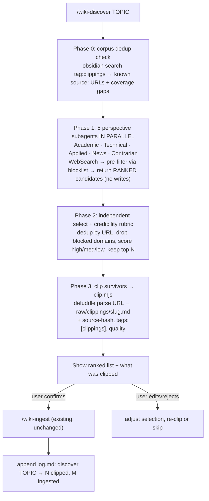

# wiki-discover — Design Spec

**Date:** 2026-07-15
**Status:** Approved design → ready for implementation planning
**Depends on:** the base wiki-master plugin (raw/clippings contract + `/wiki-ingest`), branch `feat/wiki-master-impl` (PR #1). Built on branch `feat/wiki-discover`.

---

## 1. Summary

`/wiki-discover <topic>` adds **autonomous ingestion** to wiki-master: Claude sends
out parallel "perspective" subagents to discover good web sources on a topic,
credibility-ranks them, clips the survivors into `raw/clippings/` at
Web-Clipper fidelity, shows the user the ranked list, and — on confirmation —
hands off to the existing `/wiki-ingest`.

**The clean seam:** discovery ends at `raw/clippings/`. Everything downstream is
the current, tested pipeline, unchanged. Discovery subagents are **read-only
researchers that return candidates; they never write the vault.** The only writer
to `raw/` is a deterministic clip helper.

### Decisions locked during brainstorming

| Decision | Choice |
|---|---|
| Pipeline end | Clip → show ranked list → **user confirms** → `/wiki-ingest`. Human-in-loop at source curation. |
| Clip engine | **Shell out to the Defuddle CLI** (`defuddle parse <url> --md --frontmatter`). Keeps the plugin's own code dependency-free; Defuddle is the Obsidian Web Clipper's own engine, so clips match the extension. |
| Discovery depth | **Single round.** Run again for more. No multi-round/gap-reflection in v1. |
| Quality field | **Add `quality: high\|medium\|low`** to the clip frontmatter, from the credibility gate. |
| Perspectives | Fixed **5** (Academic, Technical, Applied, News/Trends, Contrarian). |
| Dedup / quality infra | URL-set + `source-hash` + static domain blocklist. **No vector DB, no server.** |

### Repurposed components (all MIT/Apache — clean)

- **Clipping:** [Defuddle](https://github.com/kepano/defuddle) (kepano) — the Web
  Clipper's extraction engine; standalone CLI, headless, emits near-exact
  `raw/clippings/` frontmatter.
- **Discovery blueprint:** [nvk/llm-wiki](https://github.com/nvk/llm-wiki)
  (parallel perspective agents + independent credibility review + URL dedup).
- **Quality gate:** [STORM](https://github.com/stanford-oval/storm)'s static
  unreliable-domain blocklist (from Wikipedia Perennial Sources).

---

## 2. New components

```
commands/wiki-discover.md          # orchestrator command (Claude drives subagents)
skills/wiki-discoverer/SKILL.md    # the discipline: perspectives, credibility rubric, dedup rules
scripts/clip.mjs                   # deterministic: url → defuddle → raw/clippings/<slug>.md
scripts/lib/blocklist.mjs          # STORM's static unreliable-domain filter
assets/unreliable-domains.txt      # the domain list (shipped asset)
test/clip.test.mjs                 # unit tests for the pure clip helpers
test/blocklist.test.mjs            # unit tests for domain matching
```

**Changes to existing files (minimal):**
- `commands/wiki-init.md` / `scripts/init.mjs` — add a check that Defuddle is
  reachable (`defuddle --version` or `npx --yes defuddle --version`) and print an
  install hint if not.
- `skills/wiki-maintainer/SKILL.md` — document the new `quality` frontmatter field
  so `/wiki-ingest` and `/wiki-lint` can prioritize/quarantine low-tier sources.

---

## 3. The flow



- **Phase 0 (dedup-before-search):** the orchestrator gathers existing clipping
  `source:` URLs (`obsidian search query="tag:clippings"` + read frontmatter) and a
  short "what the wiki already covers" summary from `index.md`, and passes both to
  every subagent so they skip dupes and hunt for *gaps*.
- **Phase 1 (fan-out):** 5 perspective subagents launched in parallel (one message,
  Agent tool). Each runs 2–3 varied `WebSearch` queries in its lens, pre-filters
  result URLs through the blocklist, `WebFetch`es promising hits, and **returns a
  ranked candidate list** — `{title, url, quality_guess, key_findings, why_ingest}`
  — writing nothing.
- **Phase 2 (independent select):** a credibility pass **separate from the finders**
  (avoids "fox guarding the henhouse"): dedup by URL, drop blocked domains, score
  each survivor `high|medium|low` via the rubric, keep the top N.
- **Phase 3 (clip):** for each survivor, `clip.mjs` writes the raw clipping.
- **Confirm gate:** the orchestrator shows the user the ranked list + clip results;
  on confirmation it calls `/wiki-ingest`; otherwise the user edits/rejects.

---

## 4. The clip helper (`scripts/clip.mjs`)

`node clip.mjs <url> --quality=high`:

1. **Blocklist:** reject if the URL's domain is on the blocklist (`blocklist.mjs`).
2. **Dedup:** skip if the URL already exists as a `source:` in any `raw/clippings/`
   file (or if the target slug already exists).
3. **Extract:** shell `defuddle parse <url> --md --frontmatter` (prefer a global
   `defuddle`; fall back to `npx --yes defuddle`).
4. **Post-inject** the fields Defuddle doesn't own: `created` (today), `tags:
   [clippings]`, `quality`, `source-hash` (sha256 of the body). Normalize the slug
   (strip `\/:*?"<>|`, cap length).
5. **Thin-content guard:** if Defuddle returns below a word-count floor (SPA /
   paywall), **write nothing** and report the URL for manual clipping. No browser
   fallback in v1.
6. Write `raw/clippings/<slug>.md`.

**Frontmatter contract delta:** clippings gain `quality: high|medium|low`.
Everything else matches the existing Web Clipper template (Defuddle emits
`title`/`source`/`author`/`published`; `created`/`tags`/`source-hash`/`quality`
are plugin-injected).

**Pure, unit-testable helpers** (the parts not needing network/defuddle):
`slugify(title)`, `buildFrontmatter({defuddleFm, quality, created, hash})`,
`isDuplicateUrl(url, knownUrls)`, and `blocklist.isBlocked(url)`.

---

## 5. Dedup & quality gating (cheap, no DB)

**Dedup — three free layers:**
1. Phase 0 hands each subagent the known-`source:`-URL set → they skip dupes at
   search time.
2. Phase 2 dedups candidates by URL.
3. `clip.mjs` refuses a URL already clipped; `source-hash` remains the re-ingest
   guard. **No embeddings** (the Ollama embedder stays reserved for `/wiki-lint`
   drift, as designed).

**Quality gating — two complementary mechanisms:**
1. **Static domain blocklist** (`assets/unreliable-domains.txt`, from STORM /
   Wikipedia Perennial Sources): a pure `domain-in-set` check applied *before*
   fetching — kills SEO-spam/content-farms/forums for zero LLM cost.
2. **Independent credibility rubric** (Phase 2, in the `wiki-discoverer` skill):
   peer-reviewed / recency / known author / corroborated-by-another-perspective →
   `high|medium|low`. Runs separately from the finder that surfaced the source.

---

## 6. Testing & out-of-scope

**TDD (unit-tested against fixtures, no network):**
- `scripts/lib/blocklist.mjs` — `isBlocked(url)` true/false against a fixture list
  (exact domain, subdomain match, non-match, case-insensitivity).
- `scripts/clip.mjs` pure helpers — `slugify` (illegal chars, length cap),
  `buildFrontmatter` (injects `quality`/`created`/`tags`/`source-hash`; preserves
  Defuddle's `title`/`source`/`author`), `isDuplicateUrl`.
- The `defuddle` shell-out and file write are integration paths: the shell-out is
  mocked in unit tests and **verified live once** against a real URL (like the CLI
  smoke), writing into a throwaway vault.

**Prose (verified by a live `/wiki-discover` run, not unit tests):**
- `skills/wiki-discoverer/SKILL.md` — the 5 perspectives, their query strategies,
  the credibility rubric, and the dedup/no-write rules.
- `commands/wiki-discover.md` — the orchestration steps + the confirm gate.

**Out of scope for v1 (flagged for later):**
- Multi-round / gap-reflection discovery (single round only).
- Browser (Playwright) or Jina Reader fallback for SPA/paywalled pages.
- Configurable perspective count (fixed 5).
- Auto-maintaining the blocklist (shipped as a static asset).

---

## 7. Risks / open notes

- **Defuddle availability.** The plugin shells to it; if absent, `clip.mjs` should
  fail with a clear "install Defuddle (`npm i -g defuddle`, or it will use `npx`)"
  message, and `/wiki-init` should surface this at setup.
- **Thin-content pages** (SPA/paywall) silently produce poor clips with plain
  fetch; the word-count guard turns that into an explicit "clip manually" report
  rather than a bad clipping. Browser fallback is the v2 answer.
- **Cost.** 5 parallel research subagents per run is the main token cost; single-
  round + the pre-fetch blocklist keep it bounded and predictable. Run again for
  more depth rather than looping unattended.
- **Quarantine semantics.** `quality: low` clippings are still ingested unless the
  user rejects them at the confirm gate; `/wiki-lint` can later flag low-quality
  provenance. (No automatic quarantine in v1 — surfaced, not enforced.)
